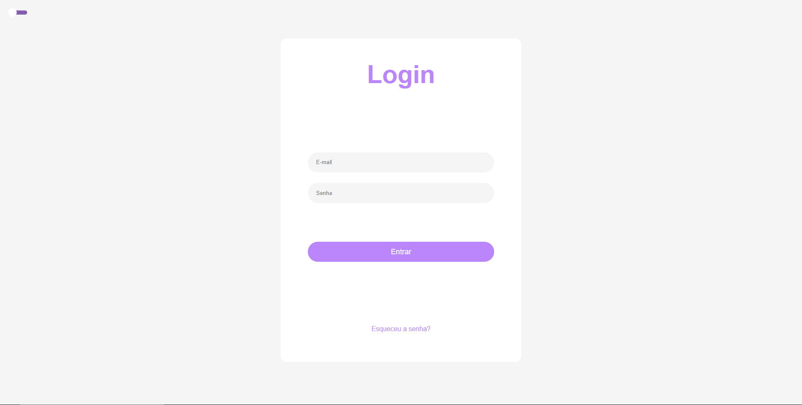
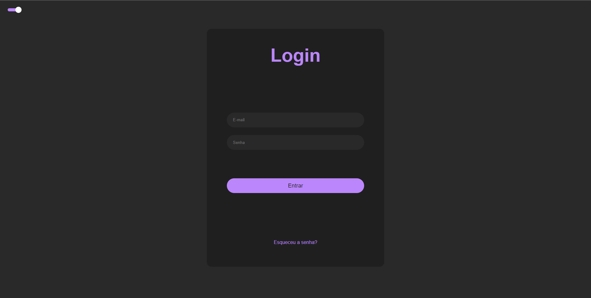

<h1 align="center">Login with React Switch Theme</h1>

<h1 align="center"></h1>

## ✏️ About the project

Login's form, applying the theme switcher changes inside an web application

## 👨‍💻 Technologies

<p display="block" align="left">
  <a href="https://reactjs.org/">React JS</a>&nbsp;&nbsp;&nbsp;|&nbsp;&nbsp;
  <a href="https://www.typescriptlang.org/docs/">TypeScript</a>
</p>

## ✏️ Run the application

Execute ```npm install``` in your IDE's terminal.

Run ```npm start``` and acess to **localhost:3000**.

### 💻 About the desktop
<p align="center">

  
</p>

## 🔗 Link
https://themes-phi.vercel.app/

---

<h4 align="center"> <em>&lt;/&gt;</em> by <a href="https://github.com/PhOmena" target="_blank">PhOmena</a> </h4>


